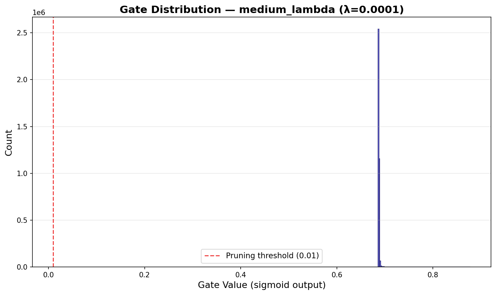
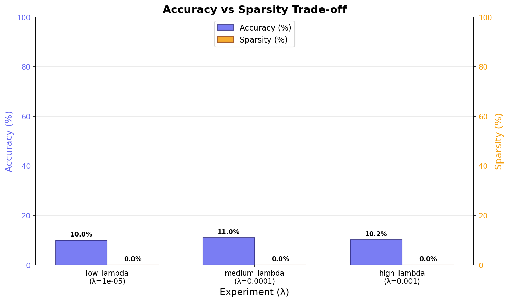

# Self-Pruning Neural Network — Experiment Report

*Generated on 2026-04-19 16:14:01*

---

## 1. Why L1 on Sigmoid Gates Induces Sparsity

Each weight $w_{ij}$ in a `PrunableLinear` layer is paired with a learnable **gate score** $g_{ij}$ (unconstrained real value).  During the forward pass the effective weight is:

$$\hat{w}_{ij} = w_{ij} \cdot \sigma(g_{ij})$$

where $\sigma$ is the sigmoid function mapping $g_{ij}$ to $[0, 1]$.

The total training loss is:

$$\mathcal{L} = \mathcal{L}_{\text{CE}} + \lambda \sum_{i,j} \sigma(g_{ij})$$

The L1 penalty on $\sigma(g_{ij})$ pushes these values toward **zero**, because the derivative $\frac{\partial}{\partial g_{ij}} \sigma(g_{ij}) = \sigma(g_{ij})(1 - \sigma(g_{ij}))$ is always positive for finite $g$, so the penalty gradient always points in the direction of decreasing $g$.

When $\sigma(g_{ij}) \approx 0$, the effective weight $\hat{w}_{ij} \approx 0$, meaning that connection is effectively **pruned** from the network.

The hyper-parameter $\lambda$ controls the sparsity–accuracy trade-off: higher $\lambda$ produces sparser networks at the potential cost of accuracy.

---

## 2. Configuration

| Parameter | Value |
|-----------|-------|
| Input dim | 3072 |
| Hidden dims | [1024, 512, 256] |
| Output dim | 10 |
| Epochs | 30 |
| Batch size | 128 |
| Learning rate | 0.001 |
| Optimizer | adam |
| Gate threshold | 0.01 |
| Seed | 42 |

---

## 3. Experiment Results

| Experiment | Lambda (λ) | Test Accuracy (%) | Sparsity (%) |
|------------|------------|-------------------|--------------|
| low_lambda | 1e-05 | 10.00 | 0.00 |
| medium_lambda | 0.0001 | 11.00 | 0.00 |
| high_lambda | 0.001 | 10.20 | 0.00 |

### 3.1 Per-Layer Sparsity

**low_lambda** (λ = 1e-05):

| Layer | Sparsity (%) |
|-------|-------------|
| Layer 0 | 0.00 |
| Layer 1 | 0.00 |
| Layer 2 | 0.00 |
| Layer 3 | 0.00 |

**medium_lambda** (λ = 0.0001):

| Layer | Sparsity (%) |
|-------|-------------|
| Layer 0 | 0.00 |
| Layer 1 | 0.00 |
| Layer 2 | 0.00 |
| Layer 3 | 0.00 |

**high_lambda** (λ = 0.001):

| Layer | Sparsity (%) |
|-------|-------------|
| Layer 0 | 0.00 |
| Layer 1 | 0.00 |
| Layer 2 | 0.00 |
| Layer 3 | 0.00 |

---

## 4. Visualisations

### Gate Value Distribution (Best Model)

A strong spike near 0 indicates successful pruning — those weights have been effectively removed by the network.

### Accuracy vs Sparsity Trade-off

Higher λ values push more gates toward zero (higher sparsity) but may reduce classification accuracy.  The optimal λ balances both.

---

## 5. Conclusion

* **Best accuracy**: medium_lambda — 11.00% (sparsity: 0.00%)
* **Highest sparsity**: low_lambda — 0.00% (accuracy: 10.00%)

The results confirm the expected trade-off: increasing the sparsity penalty (λ) drives more gate values toward zero, yielding a sparser network, while the classification loss keeps essential connections alive.

---

*Report auto-generated by `src/utils/report.py`.*
